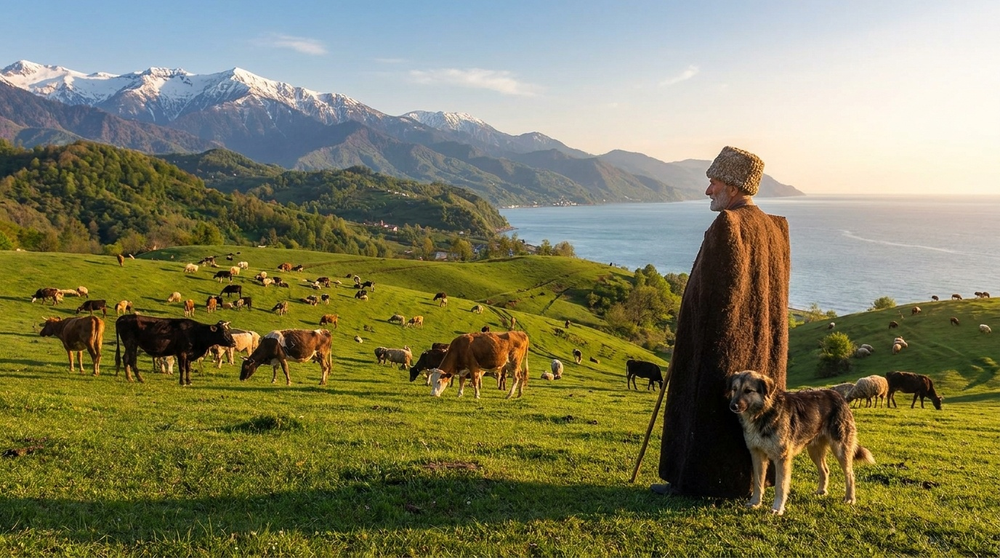
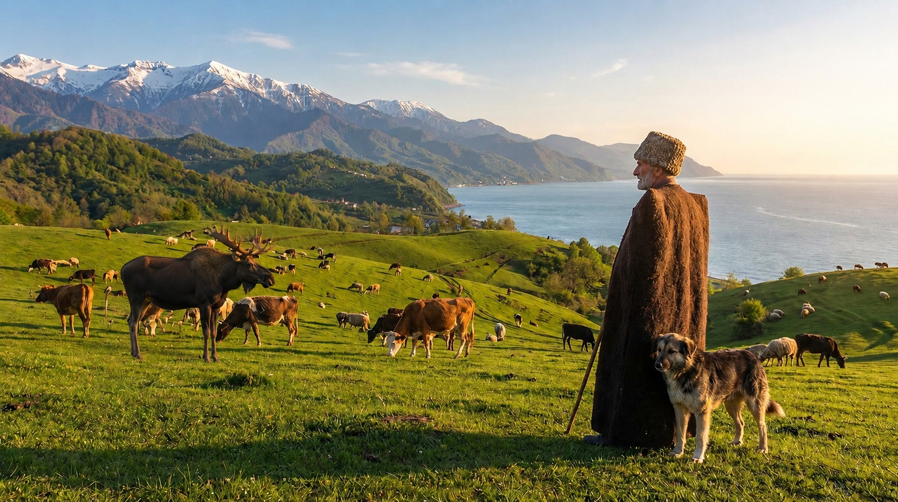
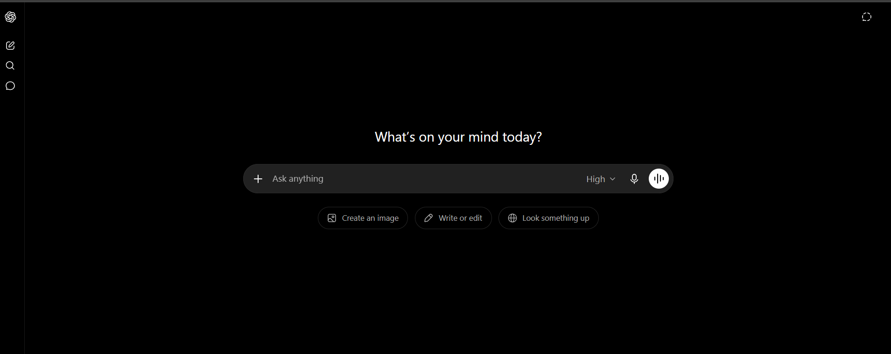
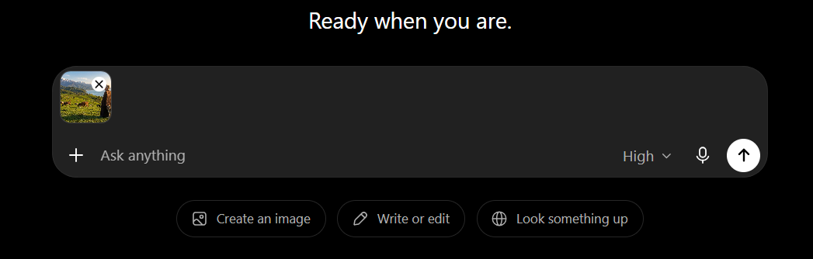
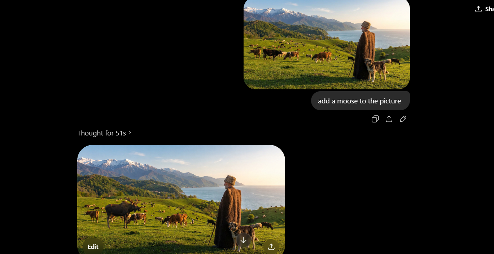
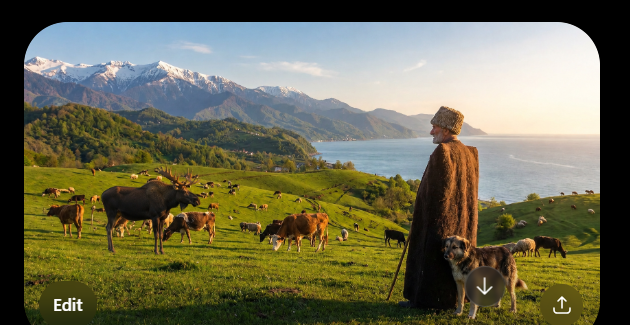
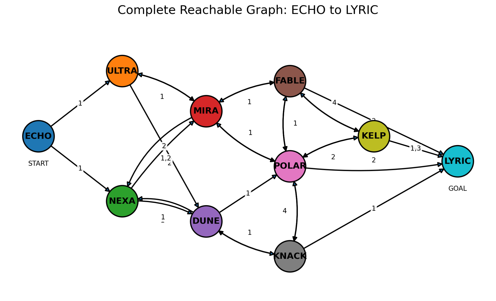

# Introduction to AI Final Exam Answers

**Student:** Hareem Khan  
**Program:** Computer Engineering (International)  
**Date:** July 7, 2026

---

## Task 1. Using Generative AI

Original picture:

Final picture after adding a moose:

---

## Task 2. User Manual: Adding a Moose to the Picture Using ChatGPT

### Goal

The goal of this task is to use a generative AI tool to add a realistic moose to the provided image and save the final image for the assignment.

### Tool Used

For this task, I used ChatGPT because it allows users to upload an image and request image edits using natural language.

### Step 1. Open ChatGPT and sign in

Open ChatGPT in a web browser. If you already have an account, click **Log in** and enter your details. If you do not have an account, click **Sign up**, enter your email address, create a password, and complete the verification steps.

Screenshot of the sign-in or sign-up page:

### Step 2. Download the initial picture

Open the picture link provided in the assignment and save the image on your computer as:

`picture-template.jpeg`

Initial picture:

### Step 3. Upload the picture to ChatGPT

In ChatGPT, click the upload or attachment button. Choose the file `picture-template.jpeg` from your computer and upload it into the chat.

Screenshot of uploading the image:

### Step 4. Write the image editing prompt

After uploading the image, I wrote this prompt:

> add a moose to the picture 

Screenshot of the prompt:

### Step 5. Generate and review the result

ChatGPT generated a new edited image. I checked that the moose was clearly visible, realistic, and placed naturally in the field without damaging the original background.

Screenshot of the generated result:

### Step 6. Save the final image

I saved the final edited image as:

`moose-result.jpeg`

Final result:

---

## Task 3. Finding the Graph

I explored the chatbot and recorded every reachable state and every transition between states. The complete graph is shown below.

---

## Task 4. Build a Web Application

The GPA calculator web application is placed in the GitHub repository under this folder:

`gpa/index.html`

The application consists of exactly one HTML file. CSS and JavaScript are embedded inside the same file. No external libraries, frameworks, CDNs, or additional files are used for the web application.
